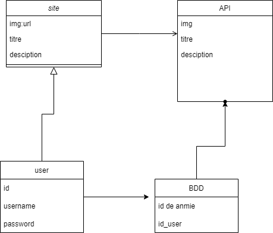

## Mission :  Projet Anime Liste
###  Mission My Anime list (BTS - SIO) - 21/10/2022
#### [Gwendal PRUNY](mailto:gwendal.pruny@gmail.com) ESIEE-IT
#### [Lakdar KARABADJA](mailto:lakdar.karabadja@gmail.com) ESIEE-IT
#### [Edris PAIKAN ](mailto:paikanadris@gmail.com) ESIEE-IT
#### API choisi :   Anime Liste 
------

------
RoadMap :

 -> https://my-anime-list.atlassian.net/jira/software/c/projects/MAL/boards/1/roadmap

[✅] Cahier des charge -> need design refacto @Zerio

[✅] Planning du projet ( https://my-anime-list.atlassian.net/jira/software/c/projects/MAL/boards/1/roadmap )

[✅] Charte graphique ( WIP -> readme.md ) @Zerio 

[✅] Modélisation des données ( To do -> readme.md )

[⏳] Développement ( Recette graphique @Lakdar | Collection @Zerio | Register/Login/Forget-password @Edrisp )

[⏳] Documentation utilisateur @Edrisp

Etape ① : Cahier des charge

##  Nom de l'appli : Myanimelist

##  Description :
Application qui permet de rechercher des animés grâce à une API.

## Fonctionnalitées :
- Créer un formulaire de recherche pour les animés, en les affichant les résultats et la possibilité de les trier et de les filtrer.
- Pouvoir de collectionner des résultats en les ajoutant à sa liste de favori
- Pouvoir exporter sa liste personnelle de favori afin de pouvoir le partager avec n'importe qui.
- Pouvoir rechercher les anime par note

## Technologies et Outils utilisées :

Technologies :
- JS ou PHP
- Html/Css

Outils :
- Figma 
- Jira (Gestion de proejt)
- Discord
- Vscode
- Mysql 
Charte graphique :

Le thème sera sobre : 
- Couleur principal (#fff)
- Couleur secondaire (##7eb795)(#a2a2a2)
  
Modélisation des données :

